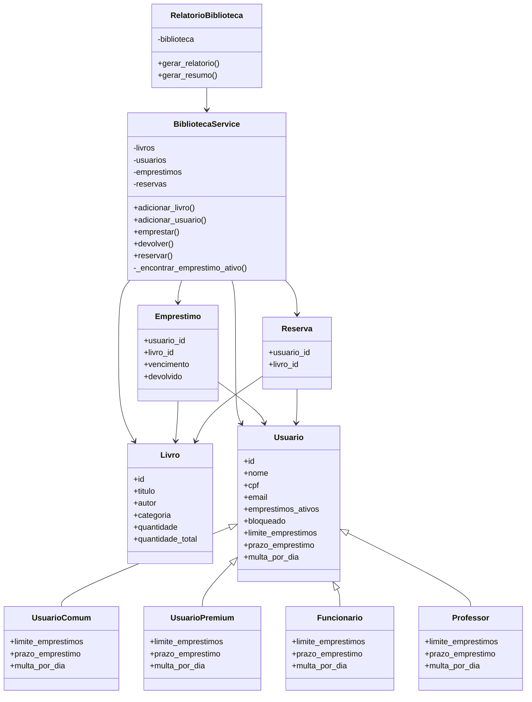

# Diagrama de Classes

## Descrição

O sistema utiliza **herança e polimorfismo** para representar os diferentes tipos de usuários. Cada tipo de usuário possui suas próprias regras de limite de empréstimos, prazo e multa, evitando condicionais espalhadas pela lógica principal.

A `BibliotecaService` concentra as operações do sistema, enquanto `RelatorioBiblioteca` é responsável exclusivamente pela geração dos relatórios.
